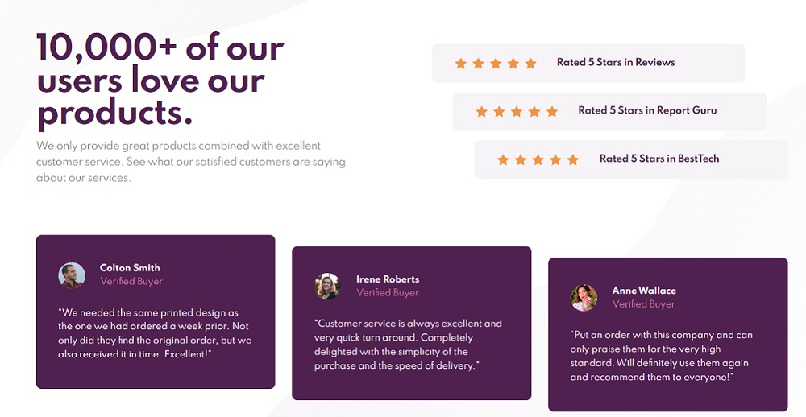

# Frontend Mentor - Social proof section solution

This is a solution to the [Social proof section challenge on Frontend Mentor](https://www.frontendmentor.io/challenges/social-proof-section-6e0qTv_bA). Frontend Mentor challenges help you improve your coding skills by building realistic projects. 

## Table of contents

- [Overview](#overview)
  - [The challenge](#the-challenge)
  - [Screenshot](#screenshot)
  - [Links](#links)
- [My process](#my-process)
  - [Built with](#built-with)
  - [What I learned](#what-i-learned))


## Overview

### The challenge


### Screenshot




### Links

- Solution URL: [solution](https://your-solution-url.com)
- Live Site URL: [live](https://mehdi-adham.github.io/social-proof-section-master/)

## My process

### Built with

- Semantic HTML5 markup
- CSS custom properties
- Flexbox
- CSS Grid


### What I learned

I'm worked with flexbox and grid layout.

```css
  .social-proof {
    width: 90%;
    display: grid;
    grid-template-columns: 1fr;
    grid-gap: 2.5em;
    grid-template-areas:
      "proof-info-item"
      "rated-info-item"
      "users-info-item";
  }
```
